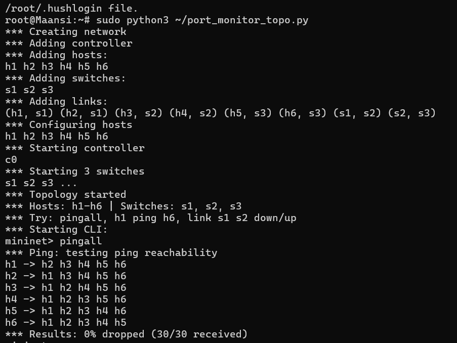
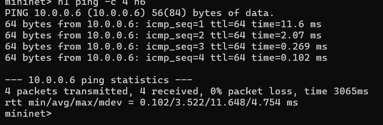
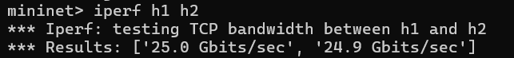
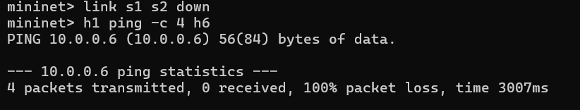
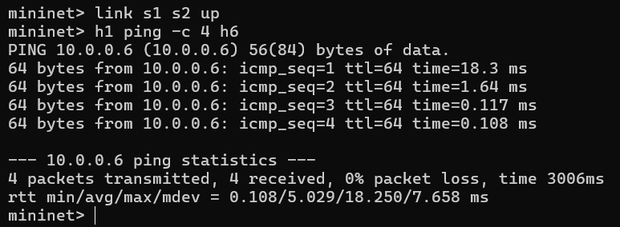
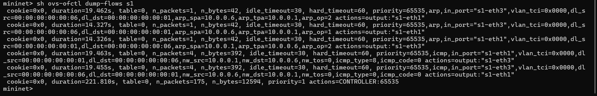
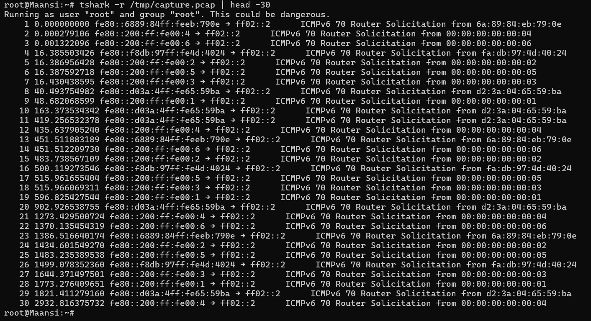
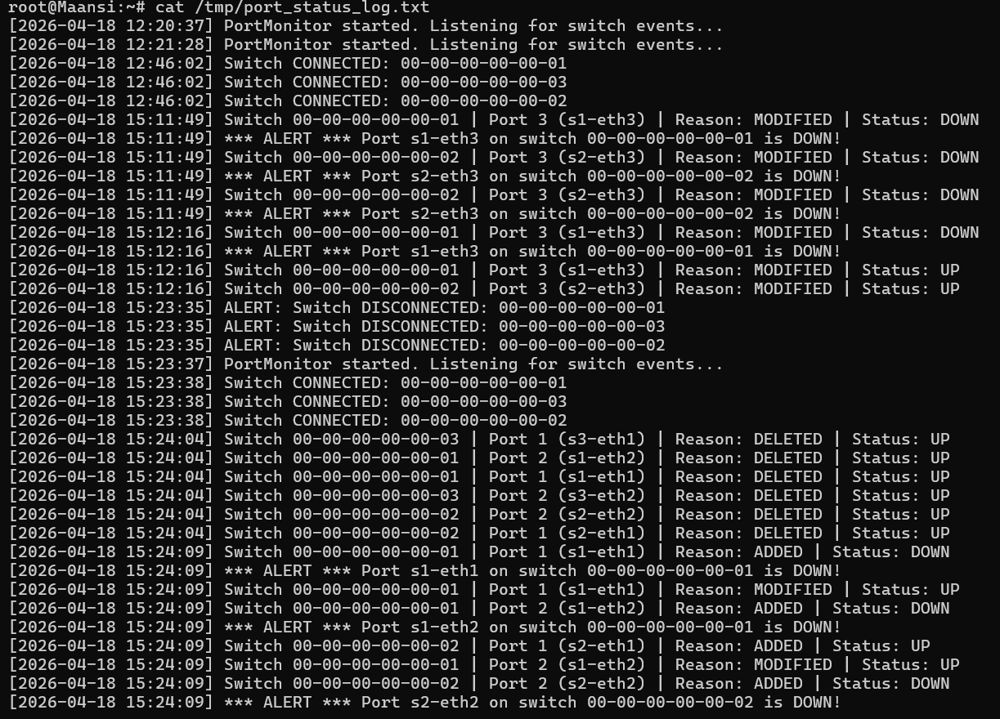
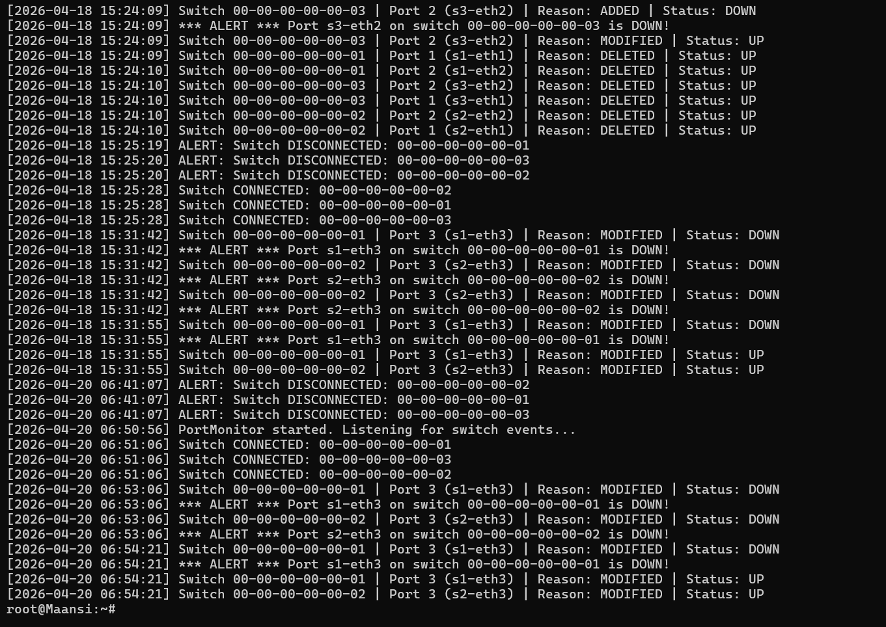

# SDN Port Status Monitoring Tool

## Problem Statement
An SDN-based Port Status Monitoring Tool using Mininet and POX controller (OpenFlow).
Monitors switch port up/down events in real time, logs all changes with timestamps,
generates alerts when ports go down, and displays current port status.

## Topology
- 3 switches (s1, s2, s3) connected in a line
- 6 hosts (h1-h6), 2 per switch
- Remote POX controller on 127.0.0.1:6633
h1 ──┐                 ┌── h5
     s1 ───── s2 ───── s3
h2 ──┘   |         |   └── h6
        h3        h4

## Setup & Execution

### 1. Install dependencies
```bash
sudo apt install -y mininet python3
git clone https://github.com/noxrepo/pox.git
```

### 2. Copy controller
```bash
cp port_monitor.py ~/pox/ext/
```

### 3. Start POX controller (Terminal 1)
```bash
cd ~/pox
python3 pox.py log.level --DEBUG port_monitor
```

### 4. Start Mininet topology (Terminal 2)
```bash
sudo python3 port_monitor_topo.py
```

### 5. Run tests in Mininet CLI
## Test Scenarios

### Scenario 1 - Normal Operation (Port UP)
- pingall shows all 6 hosts reachable (0% dropped)
- h1 ping h6 succeeds across all 3 switches
- iperf shows ~25 Gbits/sec bandwidth

### Scenario 2 - Port Failure & Recovery
- link s1 s2 down triggers ALERT in POX controller
- ping shows 100% packet loss during failure
- link s1 s2 up restores connectivity (0% packet loss)

## Expected Output
- POX terminal shows timestamped port events
- ALERT messages when any port goes DOWN
- Flow table entries visible via ovs-ofctl dump-flows

## Proof of Execution

### pingall - All hosts reachable


### h1 ping h6 - Cross switch ping


### iperf - Bandwidth test


### Scenario 2 - Port failure


### Scenario 2 - Port recovery


### Flow table


### tshark packet capture


### Port status log


### POX controller events


## References
- Mininet: http://mininet.org
- POX Controller: https://github.com/noxrepo/pox
- OpenFlow 1.0 Specification: https://opennetworking.org
